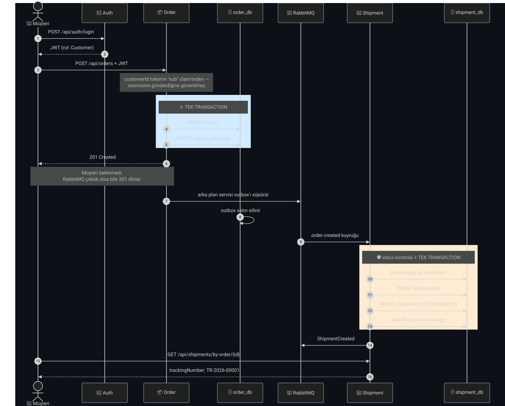

# 🚚 Logistics Microservice MVP

[](https://dotnet.microsoft.com/)
[](https://www.postgresql.org/)
[](https://www.rabbitmq.com/)
[](#-testler)
[](LICENSE)

**Event-driven mikroservis mimarisini öğrenmek ve anlatmak için yazılmış bir referans proje.**

Müşteri sipariş verir; **kimse elle tetiklemeden** saniyeler içinde bir gönderi ve takip
numarası oluşur. Arada HTTP çağrısı yok — sadece bir event.

Amaç, dağıtık sistemlerin *gerçekten zor* kısımlarını — **mesaj kaybolmaması**, **aynı
mesajın iki kez işlenmemesi**, **servislerin birbirini tanımaması** — çalışan ve test
edilmiş bir örnek üzerinden göstermek.

---

## 🗺️ Mimari

<picture>
  <source media="(max-width: 700px)" srcset="assets/mimari-mobil.svg">
  
</picture>

| Değişmez kural | Sonucu |
|---|---|
| Servisler **birbirini HTTP ile çağırmaz** | Biri çökerse diğeri çalışır |
| Servisler **birbirinin veritabanına dokunmaz** | Şema değişikliği komşuyu kırmaz |
| Aralarındaki tek yol **event'ler** | Yeni servis mevcut kodu değiştirmez |

> **Order Service, Shipment Service'in var olduğunu bilmiyor** — kodunda `Shipment`
> kelimesi hiç geçmiyor. Sadece "sipariş oluştu" diye bağırıyor; kimin duyduğu onu
> ilgilendirmiyor. Projenin tamamı bu tek fikrin üzerine kurulu.

---

## 🎬 Bir siparişin yolculuğu

<picture>
  <source media="(max-width: 700px)" srcset="assets/senaryo-mobil.svg">
  
</picture>

Üç kritik nokta:

- **Token'ı Order kendi doğrular** — Auth'a istek atmaz, imza matematiksel olarak doğrulanabilir.
- **Müşteri 201 alıp gider** — gönderinin oluşmasını beklemez. Bedeli *eventual consistency*: gönderi ~1 saniye sonra oluşur.
- **Her iki yazma da tek transaction** — yarım durum imkânsız.

---

## 🗄️ Neden tek PostgreSQL?

Tek container, **üç ayrı veritabanı**. Her servis **yalnızca kendi connection string'ini**
biliyor; `shipment_db` diye bir ayarı yok, dolayısıyla oraya bakamaz.



**Asıl sınır fiziksel değil, mantıksal.** Aynı sunucuda olmaları "bir servis diğerinin
tablosuna `JOIN` atar" kazasını mümkün kılmıyor — çünkü ayarı yok.

Üretimde ayırmak için **tek satır kod değişmez**:

```yaml
# Local
ConnectionStrings__OrderDb: "Host=postgres;Database=order_db;..."
# Üretim — sadece ortam değişkeni
ConnectionStrings__OrderDb: "Host=order-db.prod.internal;Database=orders;..."
```

Her servisin ayarı bağımsız olduğu için taşıma **tek tek** yapılabilir.
Tek container bilinçli bir local kolaylık: az RAM, hızlı açılış, tek healthcheck.

---

## 🧩 Ortak projeler

Üç servisin de referans verdiği iki proje var — ve **çok farklı şeyler**.

| | 📜 **Contracts** | 🧱 **BuildingBlocks** |
|---|---|---|
| Ne paylaşır | **Sözleşme** — veri şekli | **Altyapı** — teknik kod |
| Kime bakar | Dışarıya: başkasının okuyacağı şey | İçeriye: kendi işimi kolaylaştıran |
| Değişirse | **Diğer servisler kırılır** | Kendi kodumu derlerim |
| İçerik | `OrderCreated`, `ShipmentCreated`, `Roles` | `Result<T>`, `BaseEntity`, `IEventBus`, JWT + MassTransit kurulumu |
| Bağımlılık | **Sıfır** | Sadece teknik paketler |

**Contracts neden ayrı?** Order yayınlıyor, Shipment dinliyor — **ikisi de aynı C# tipini**
referans ediyor. Ayrı olmasaydı Shipment'ın, Order'ın iç katmanlarına referans vermesi
gerekirdi; o an tek uygulama oluruz.

**BuildingBlocks neden var?** Üç servis × aynı JWT kurulumu = üç kopya, ve o üç kopyadan
biri farklı kalınca bulunması çok zor bir hata. **İş mantığı asla girmez.**

> ⚠️ Contracts'ta bir alanı **silmek veya adını değiştirmek** breaking change'dir; yeni
> alan eklemek güvenlidir. Namespace değiştirmek bile kırıcıdır — RabbitMQ exchange adı
> `namespace + tip adı`ndan türetilir.

### 🔮 Gerçek hayatta: NuGet paketi

Bu depoda ikisi de proje referansı — öğrenmek için en kolay hâli. Gerçek bir şirkette
özel bir NuGet beslemesine yayınlanır:

```xml
<PackageReference Include="Logistics.Contracts" Version="2.1.0" />
```



**Bu neden bağımlılık sorunu değil?**

- **Sürümlenmiş** — Order `v2.1.0`'a geçerken Shipment `v2.0.0`'da kalabilir. Aynı anda deploy zorunluluğu yok.
- **İsteğe bağlı** — Bir servis o paketi hiç kullanmayabilir; başka dilde bile yazılabilir. Sözleşme JSON'dur, C# değil.
- **Tek yönlü** — Kimse kimsenin *iç* koduna bakmıyor, herkesin kabul ettiği bir şekle bakıyor.

Asıl kaçınılması gerekenler: **paylaşılan veritabanı**, **paylaşılan runtime**, **senkron
çağrı zincirleri**. Bu projede üçü de yok.

---

## 🏛️ Katmanlar



**Oklar hep içeri bakar.** Domain kimseyi tanımaz; Application, Domain'i tanır ama EF
Core'u tanımaz.

Handler'ın veritabanına yazması gerekir — ama Application'da veritabanı yoktur. Çözüm:
**interface Application'da tanımlanır, implementasyonu Infrastructure'da yaşar.**

```csharp
// Application — sadece sözleşme, EF Core'dan haberi yok
public interface IShipmentRepository { void Add(Shipment shipment); }

// Infrastructure — teknoloji burada
public sealed class ShipmentRepository(ShipmentDbContext ctx) : IShipmentRepository
{
    public void Add(Shipment shipment) => ctx.Shipments.Add(shipment);
}
```

**Kod Application'da, nesne Infrastructure'dan.** Somut karşılığı: 78 birim testi hiç
veritabanı olmadan, ~1.5 saniyede çalışıyor.

---

## 🛡️ İki zor problem

### 1 · Dual write — "event kayboldu"

Sipariş oluşunca veritabanına yaz **ve** event gönder. Ama bunlar **iki ayrı sistem** ve
aralarında ortak transaction yok:

```
✅ DB yazıldı → 💥 süreç öldü → ❌ event gitmedi
   Sipariş var, gönderi HİÇ oluşmaz. Müşteri bekler, sistem sessiz.
```

`try/catch` bunu **çözmez** — catch bloğu çalışmadan da ölebilirsin. Sorun hata yakalamak
değil, **iki sistemi atomik yapamamak**.

**Çözüm: Transactional Outbox.** Event'i de bir veritabanı satırı yap:

<picture>
  <source media="(max-width: 700px)" srcset="assets/outbox-mobil.svg">
  
</picture>

Broker 10 dakika çökük kalsa bile hiçbir event kaybolmaz.
`outbox_message` bir kuyruk değil, **bekleme odası** — gönderilen satır silinir.

### 2 · At-least-once — "aynı mesaj iki kez geldi"

Outbox, event'in kaybolmamasını garanti etti; ama "gönderildi" damgası basılmadan ölünürse
mesaj **ikinci kez** yayınlanır. Bu **kaçınılmaz** — dağıtık sistemde "tam bir kez teslimat"
diye bir şey yoktur. Elde edilebilecek olan:

```
at-least-once teslimat  +  idempotent consumer  =  ETKİSİ BİR KEZ
```

**Çözüm: iki katmanlı savunma.**



| Katman | Neyi yakalar |
|---|---|
| **`inbox_state`** | **Teknik** tekrar — aynı `messageId` iki kez → consumer hiç çalışmaz |
| **`order_id` UNIQUE** | **Mantıksal** tekrar — farklı `messageId`, aynı sipariş → DB reddeder |

İkincisi neden gerekli? `inbox_state`'in anahtarı `(messageId, consumerId)`. Yayıncı bir
hata yüzünden **yeni bir messageId** ile aynı siparişi yayınlarsa inbox onu göremez.
Koddaki "zaten var mı" kontrolü de tek başına yetmez: iki kopya aynı anda çalışırsa ikisi
de "yok" cevabını alır. **Bir yarışı ancak tek bir noktada sıraya sokabilirsin — o nokta
veritabanıdır.**

> Gerçekten bozuk bir mesaj 3 kez denenir (1sn → 2sn → 4sn), sonra `order-created_error`
> kuyruğuna taşınır ve orada **görünür** hâlde bekler. Bozuk mesaj sistemi kilitleyemez.

---

## 🚀 Çalıştır

**Gereken:** Docker Desktop. (.NET SDK yalnızca testler için.)

```bash
git clone https://github.com/erenctns/Logistic-Microservice_Mvp.git
cd Logistic-Microservice_Mvp
cp .env.example .env     # change_me_ ile başlayan değerleri doldur
docker compose up -d --build
```

| Adres | Ne |
|---|---|
| `localhost:8081` / `8082` / `8083` | Auth / Order / Shipment |
| **http://localhost:15672** | **RabbitMQ arayüzü** |
| `localhost:5432` | PostgreSQL |

### Uçtan uca dene

```bash
TOKEN=$(curl -s -X POST http://localhost:8081/api/auth/login \
  -H "Content-Type: application/json" \
  -d '{"email":"customer@smartlogistics.local","password":"<SEED_DEFAULT_PASSWORD>"}' | jq -r .token)

ORDER=$(curl -s -X POST http://localhost:8082/api/orders \
  -H "Authorization: Bearer $TOKEN" -H "Content-Type: application/json" \
  -d '{"deliveryAddress":"Moda, Kadikoy","packageSize":"Large"}' | jq -r .orderId)

sleep 2 && curl -s http://localhost:8083/api/shipments/by-order/$ORDER \
  -H "Authorization: Bearer $TOKEN" | jq
```

```json
{ "trackingNumber": "TR-2026-00001", "status": "Created", "deliveryAddress": "Moda, Kadikoy" }
```

**Gönderiyi oluşturmak için hiçbir şey yapmadın.** Bir event yeterliydi.

---

## 🔍 Kendi gözünle gör

**1 · Outbox** — broker'ı çökert, sonra sipariş oluştur:

```bash
docker compose stop rabbitmq
```

**HTTP 201 alırsın.** `order_db.outbox_message`'da 1 satır bekliyor.
`docker compose start rabbitmq` → satır silinir, gönderi oluşur. Hiçbir şey kaybolmaz.

**2 · Asenkronluk** — tüketiciyi durdur, sonra sipariş oluştur:

```bash
docker compose stop shipment-service
```

RabbitMQ arayüzü → `order-created`: **Ready 1, Consumers 0**. Mesaj kayıp değil, *bekliyor*.
*Get messages* ile zarfın içine bakabilirsin.

**3 · Idempotency** — aynı zarfı `order-created` exchange'ine **iki kez** yayınla.
`inbox_state.receive_count` **artar** (mesaj gerçekten geldi), `shipments` **artmaz**
(consumer hiç çalışmadı).

```sql
-- order_db: gönderilmeyi bekleyen event'ler (normalde boş)
SELECT message_id, message_type FROM outbox_message;
-- shipment_db: işlenmiş her mesajın damgası
SELECT message_id, receive_count, consumed FROM inbox_state;
```

RabbitMQ arayüzünde: **Exchanges** (mesaj tipi başına bir fanout) · **Bindings**
(*kim dinliyor*) · **Queues** (bekleyen mesaj, tüketici sayısı).

---

## 🧪 Testler

```bash
dotnet test        # toplam: 102 · başarılı: 102 · ~38s
```

### Yaklaşım

| Katman | Adet | Nasıl test edilir |
|---|---|---|
| **Domain** | 30 | Saf, **mock yok** — entity'ler I/O'suz olduğu için gerçek nesnelerle çalışılır |
| **Application** | 48 | Bağımlılıklar `NSubstitute` ile taklit edilir; veritabanı yok, ~1.5 sn |
| **Integration** | 24 | **Testcontainers** ile **gerçek** PostgreSQL + **gerçek** RabbitMQ |

**Entegrasyon testleri in-memory veritabanı kullanmaz.** Doğrulanan şey tam olarak
transaction semantiği ve broker davranışı; in-memory taklitler bunları simüle edemez ve
yanlış güven verir.

Nasıl çalışıyor:

- **Container yaşam döngüsü** — `PostgresFixture` / `RabbitMqFixture` bir xUnit *collection*
  başına **bir kez** container kaldırır (her test sınıfı için değil), test bitince siler.
- **İzolasyon** — her test öncesi tablolar temizlenir **ve** RabbitMQ kuyrukları purge edilir.
  İki durumlu bir sistemde sadece veritabanını sıfırlamak yetmiyor.
- **Sorgu daraltma** — bütün sayımlar o testin kendi `orderId` / `messageId`'sine
  daraltılmış; sızan bir mesaj testi düşüremiyor.
- **Ayrı DI kapları** — consumer testlerinde yayıncı ve tüketici **iki ayrı** `ServiceProvider`'da
  kuruluyor, çünkü gerçekte de ayrı process'te yaşıyorlar (`AddMassTransit` kap başına bir kez çağrılabilir).
- **Gerçek servis kodu** — testler `AddApplication()` + `AddInfrastructure()` çağırıyor;
  consumer, inbox ve outbox üretimde nasıl kuruluyorsa öyle.

### Vitrin testleri

- **Outbox broker'dan bağımsız** — broker çökükken bile sipariş ve event yazılır
  `CreateOrder_WhenBrokerIsUnreachable_StillWritesOrderAndOutboxRow`

- **Atomiklik** — transaction geri alınırsa ikisi de yazılmaz
  `CreateOrder_WhenTransactionRollsBack_WritesNeitherOrderNorOutboxRow`

- **Inbox / teknik idempotency** — aynı `messageId` iki kez → tek gönderi
  `Consume_WhenSameMessageArrivesTwice_CreatesSingleShipment`

- **UNIQUE index / mantıksal idempotency** — farklı `messageId`, aynı sipariş → tek gönderi
  `Consume_WhenDifferentMessageCarriesSameOrder_StillCreatesSingleShipment`

- **Retry + DLQ** — bozuk mesaj hata kuyruğuna düşer, yarım iş bırakmaz
  `Consume_WhenMessageIsInvalid_WritesNothingAndMovesItToTheErrorQueue`

---

## 📁 Proje yapısı

```
src/
├── BuildingBlocks/       🧱 teknik altyapı (iş mantığı YOK)
├── Contracts/            📜 servisler arası sözleşmeler
└── services/
    ├── AuthService/      🔑 kimlik · JWT üretimi
    ├── OrderService/     📦 sipariş · YAYINCI (outbox)
    └── ShipmentService/  🚚 gönderi · TÜKETİCİ (inbox) + yayıncı

tests/                    102 test
infrastructure/           veritabanı init script'i
assets/                   şemalar (.svg) + Mermaid kaynakları (.mmd)
docker-compose.yml        5 container
```

Her servis dört katman: `*.Domain`, `*.Application`, `*.Infrastructure`, `*.Api`.

---

## ⚙️ Teknoloji ve alışkanlıklar

| Seçim | Gerekçe |
|---|---|
| **.NET 10** | `global.json` ile sürüm sabit |
| **MassTransit 8.5** | Outbox/inbox, retry, DLQ hazır. v9 ticari; v8 Apache-2.0 |
| **MediatR 12.5** | Apache-2.0 olan son sürüm |
| **PostgreSQL** | Gerçek transaction semantiği — outbox'ın ön şartı |
| **Testcontainers** | Testlerde gerçek altyapı |
| **AwesomeAssertions** | FluentAssertions v7'nin açık kaynak fork'u (v8 ticari) |
| **Central Package Management** | Paket sürümleri tek dosyada |

- Sır yok: bütün şifreler `.env` → ortam değişkeni. `appsettings.json` temiz.
- Container'lar **root değil** (`USER $APP_UID`).
- Başkasının kaynağı için **404**, 403 değil — 403 kaynağın varlığını sızdırır.
- `customerId` istemciden değil **JWT'nin `sub` claim'inden** okunur.
- Liveness ve readiness ayrı: veritabanı bir an düşünce container restart edilmez.

---

## 🚧 Kapsam dışı (bilinçli)

Kurye / teslimat / bildirim servisleri · API Gateway · Frontend · Dağıtık izleme
(correlation ID, Serilog) · Redis.

Mimari üç servisle zaten kanıtlanıyor; dördüncüsü aynı kalıbın tekrarı olurdu.

> `ShipmentCreated`'ı **dinleyen kimse yok** — bu bir eksiklik değil, mimarinin gösterisi:
> yayıncı kimin dinlediğini bilmez. Bir teslimat servisi eklenirse Shipment Service'te
> **tek satır değişmeden** abone olur.

---

## 📄 Lisans

[MIT](LICENSE)
