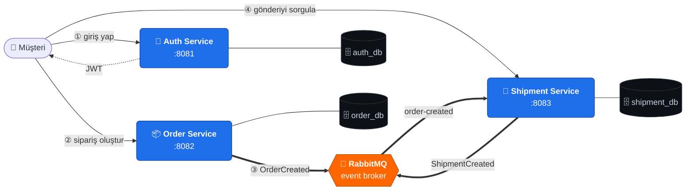
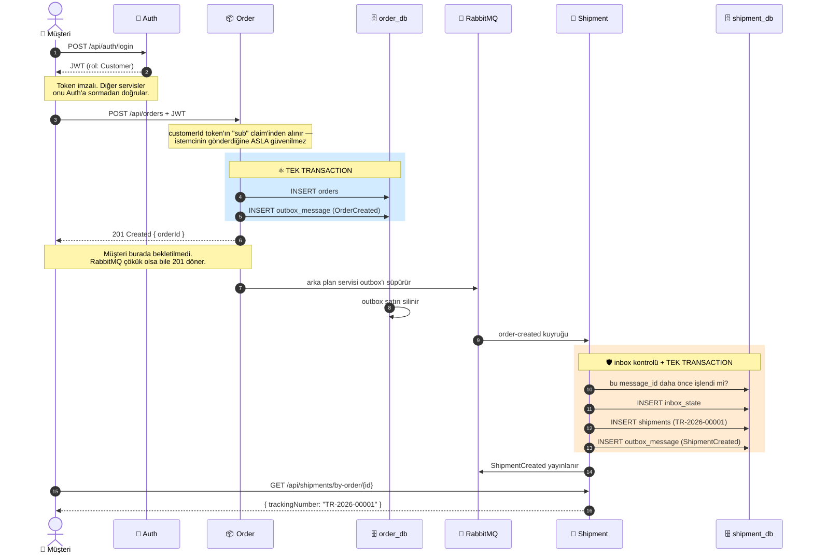
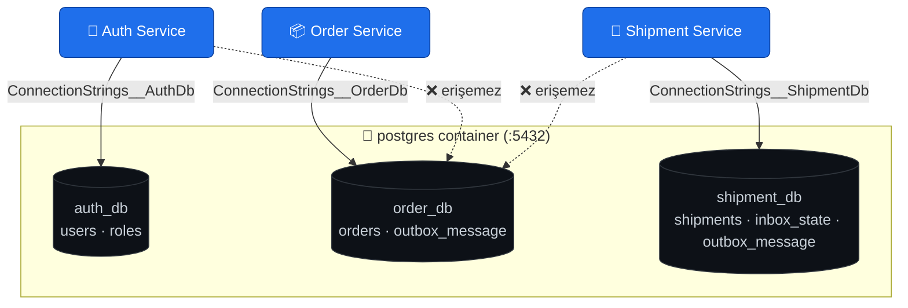
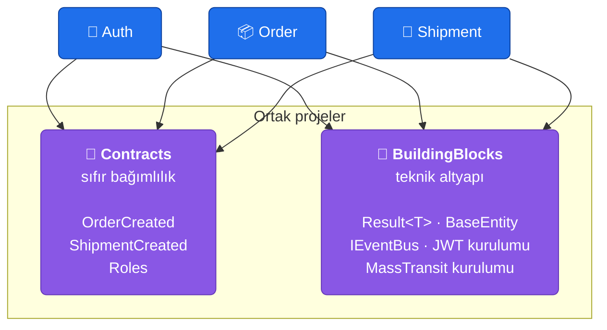
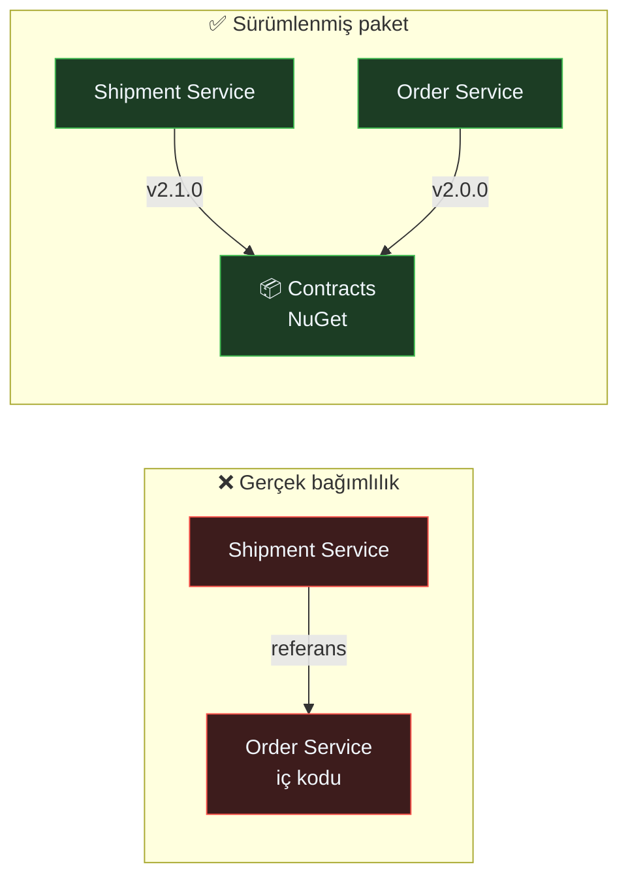
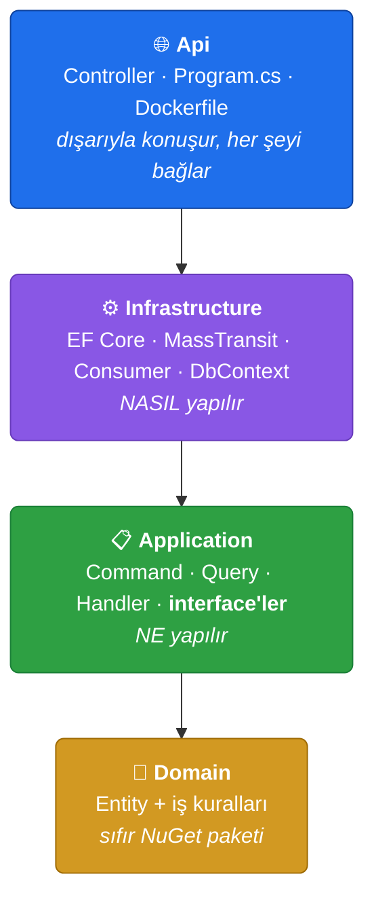
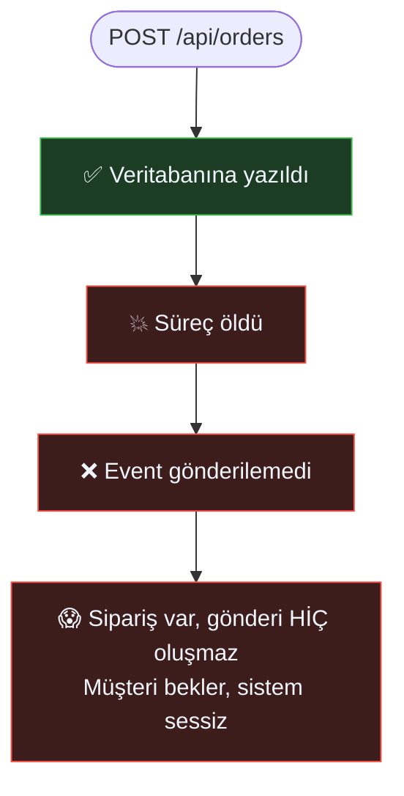
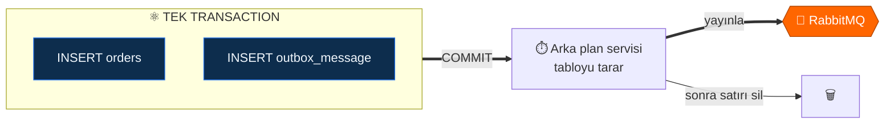
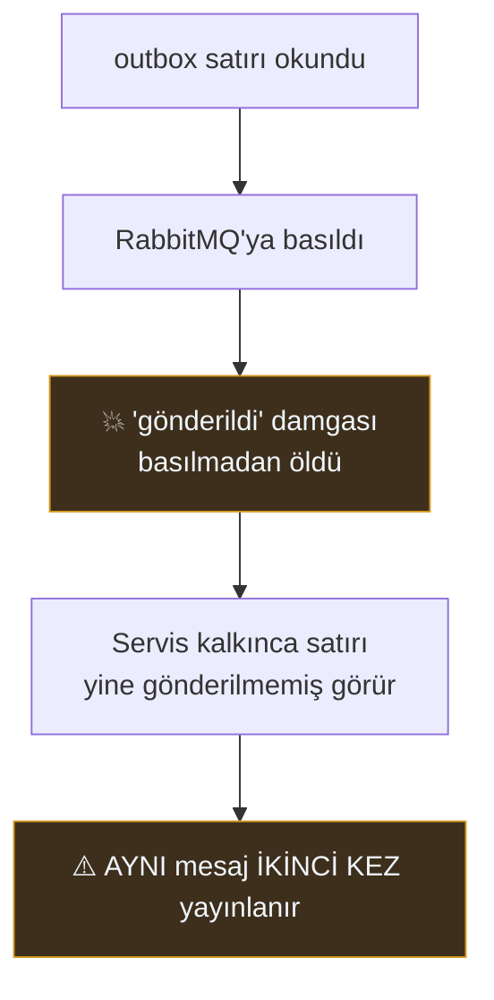
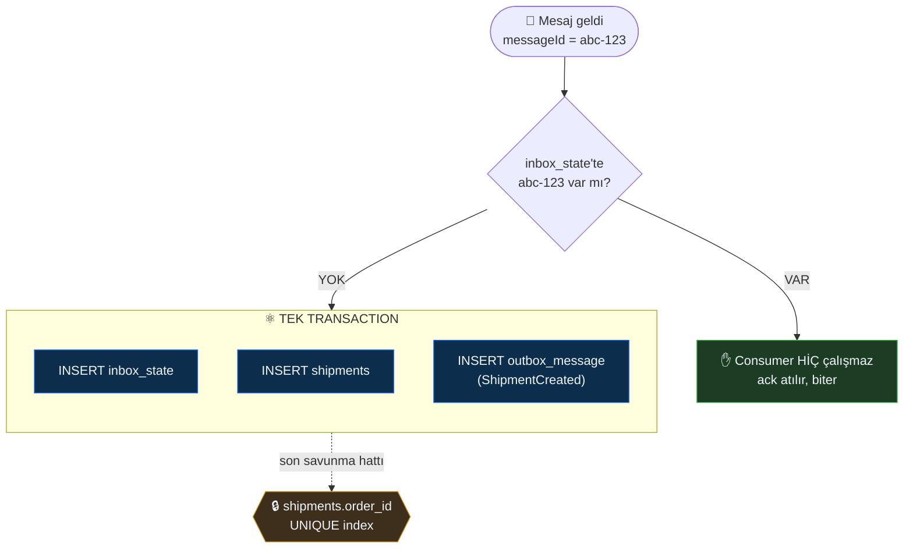

# 🚚 Logistics Microservice MVP

[](https://dotnet.microsoft.com/)
[](https://www.postgresql.org/)
[](https://www.rabbitmq.com/)
[](#-testler)
[](LICENSE)

**Event-driven mikroservis mimarisini öğrenmek ve anlatmak için yazılmış bir referans proje.**

Bir müşteri sipariş verir; **hiç kimse elle tetiklemeden** saniyeler içinde bir gönderi ve takip numarası oluşur. Arada HTTP çağrısı yoktur — sadece bir event.

Bu depo bir ürün değil. Amacı, dağıtık sistemlerin *gerçekten zor* olan kısımlarını —
**mesaj kaybolmaması**, **aynı mesajın iki kez işlenmemesi**, **servislerin birbirini
tanımaması** — çalışan, denenebilir, test edilmiş bir örnek üzerinden göstermek.

---

## 📑 İçindekiler

| | |
|---|---|
| [Mimari — kuşbakışı](#-mimari--kuşbakışı) | Sistem tek bakışta |
| [Senaryo: bir siparişin yolculuğu](#-senaryo-bir-siparişin-yolculuğu) | Adım adım tüm akış |
| [Neden tek PostgreSQL?](#-neden-tek-postgresql-database-per-service) | Mantıksal vs fiziksel sınır |
| [Ortak projeler](#-ortak-projeler-contracts-ve-buildingblocks) | Contracts ve BuildingBlocks |
| [Bir servisin iç yapısı](#-bir-servisin-iç-yapısı) | Katmanlar ve bağımlılık yönü |
| [İki zor problem](#-dağıtık-sistemin-iki-zor-problemi) | Outbox ve Inbox |
| [Çalıştır](#-çalıştır) | 3 komut |
| [Kendi gözünle gör](#-kendi-gözünle-gör) | Deneyler |

---

## 🗺️ Mimari — kuşbakışı



### Değişmez üç kural

| Kural | Sonucu |
|---|---|
| Servisler **birbirini HTTP ile çağırmaz** | Biri çökerse diğeri çalışmaya devam eder |
| Servisler **birbirinin veritabanına dokunmaz** | Şema değişikliği komşuyu kırmaz |
| Aralarındaki tek yol **event'ler** | Yeni servis eklemek mevcut kodu değiştirmez |

> **Order Service, Shipment Service'in var olduğunu bilmiyor.** Kodunda `Shipment`
> kelimesi hiç geçmiyor. Sadece "sipariş oluştu" diye bağırıyor; kimin duyduğu
> onu ilgilendirmiyor. Buna **gevşek bağlılık (loose coupling)** deniyor ve bu
> projenin tamamı bu tek fikrin üzerine kurulu.

---

## 🎬 Senaryo: bir siparişin yolculuğu

Aşağıdaki akış **gerçekte çalışan** akıştır — uydurma değil, entegrasyon testleriyle doğrulanmıştır.



### Ne oldu, sırasıyla

1. **Giriş** — Auth Service kimliği doğrular, imzalı bir JWT verir.
2. **Sipariş** — Order Service token'ı **kendi** doğrular. Auth'a hiç istek atmaz; imza matematiksel olarak doğrulanabilir.
3. **Atomik yazma** — Sipariş satırı ve "sipariş oluştu" event'i **aynı transaction'da** yazılır. İkisi ya birlikte olur ya hiç.
4. **Cevap** — Müşteri 201 alır ve yoluna devam eder. Gönderinin oluşmasını beklemez.
5. **Yayın** — Arka plan servisi event'i RabbitMQ'ya taşır ve veritabanındaki satırı siler.
6. **Tüketim** — Shipment Service mesajı alır, daha önce işleyip işlemediğini kontrol eder, gönderi oluşturur ve kendi event'ini yayınlar.
7. **Sorgu** — Müşteri gönderisini takip numarasıyla sorgular.

> **Adım 4 kritik:** Müşteri, gönderinin oluşmasını beklemiyor. Bu **asenkron** olmanın
> karşılığı: sistemin bir parçası yavaşsa ya da çökükse, kullanıcı bunu görmez.
> Bedeli ise **eventual consistency** — gönderi 1 saniye sonra oluşur, hemen değil.

---

## 🗄️ Neden tek PostgreSQL? (database-per-service)

Tek bir PostgreSQL **container'ı** var ama içinde **üç ayrı veritabanı**:



### Asıl sınır fiziksel değil, mantıksal

Her servis **yalnızca kendi connection string'ini** biliyor. Order Service'in kodunda
`shipment_db` diye bir şey geçmez; geçemez de — böyle bir ayarı yok.

Bu, "bir servis diğerinin tablosuna `JOIN` atar" kazasını **yapısal olarak** imkansız kılar.
Aynı fiziksel sunucuda olmaları bunu değiştirmez.

### Üretimde ne değişir? — sadece bir satır

Her veritabanını ayrı bir sunucuya taşımak için **tek satır kod değişmez**:

```yaml
# Local (docker-compose.yml)
ConnectionStrings__OrderDb: "Host=postgres;Database=order_db;..."

# Üretim — sadece ortam değişkeni değişir
ConnectionStrings__OrderDb: "Host=order-db.prod.internal;Database=orders;..."
```

Her servisin ayarı bağımsız olduğu için taşıma da **tek tek** yapılabilir: önce Order'ı
ayır, sonra Shipment'ı. Hepsi aynı anda taşınmak zorunda değil.

| | Local (bu depo) | Üretim |
|---|---|---|
| Container sayısı | 1 | 3 (ya da 3 managed instance) |
| Veritabanı sayısı | 3 | 3 |
| Servis kodu | — | **değişmez** |
| Değişen | — | 3 connection string |

> Tek container tercihi bilinçli bir **local kolaylık**: daha az RAM, daha hızlı açılış,
> tek healthcheck. Mimari sınır zaten connection string seviyesinde çizilmiş durumda.

---

## 🧩 Ortak projeler: Contracts ve BuildingBlocks

Üç servisin de referans verdiği iki proje var. **İkisi çok farklı şeyler** ve bu ayrımı
anlamak mikroservis mimarisinin en sık karıştırılan noktalarından biri.



### 📜 Contracts — "ne konuşuyoruz"

Servisler arasında taşınan **mesajların şekli**. Sadece veri; metot yok, iş kuralı yok.

```csharp
public sealed record OrderCreated(
    Guid OrderId, Guid CustomerId, string DeliveryAddress,
    string PackageSize, DateTime CreatedAt);
```

**Neden ayrı bir proje?** Order yayınlıyor, Shipment dinliyor — **ikisi de aynı C# tipini**
referans ediyor. Ayrı olmasaydı Shipment'ın, Order'ın iç katmanlarına referans vermesi
gerekirdi. O an mikroservis olmaktan çıkar, tek uygulama oluruz.

**Neden sıfır bağımlılığı var?** Sözleşme, yayıncının iç tiplerine bağlanmamalı.
`PackageSize` burada `enum` değil `string` — çünkü o enum Order Service'e ait.

> ⚠️ Bir alanı **silmek veya adını değiştirmek** breaking change'dir. Yeni alan eklemek
> güvenlidir. Hatta namespace'i değiştirmek bile kırıcıdır: RabbitMQ exchange adı
> `namespace + tip adı`ndan türetilir.

### 🧱 BuildingBlocks — "nasıl yazıyoruz"

Her servisin tekrar tekrar yazacağı **teknik** kod. **İş mantığı asla girmez.**

| Katman | İçerik |
|---|---|
| `BuildingBlocks.Domain` | `Result<T>`, `Error`, `BaseEntity` — **sıfır NuGet paketi** |
| `BuildingBlocks.Application` | `IEventBus` — sadece soyut sözleşme |
| `BuildingBlocks.Infrastructure` | MassTransit kurulumu, JWT doğrulama, RabbitMQ ayarları |

Üç servis × aynı JWT kurulumu = üç kopya, ve o üç kopyadan biri farklı kalınca
bulunması çok zor bir hata. Ortak yer bunu engelliyor.

### İkisinin farkı tek tabloda

| | 📜 Contracts | 🧱 BuildingBlocks |
|---|---|---|
| Ne paylaşır | **Sözleşme** — veri şekli | **Altyapı** — teknik kod |
| Kime bakar | Dışarıya: başkasının okuyacağı şey | İçeriye: kendi işimi kolaylaştıran şey |
| Değişirse | **Diğer servisler kırılır** | Kendi kodumu derlerim |
| Örnek | `OrderCreated` | `Result<T>` |

### 🔮 Gerçek hayatta: NuGet paketi

Bu depoda ikisi de **proje referansı** olarak duruyor — tek repo, tek `dotnet build`,
öğrenmek için en kolay hâli.

Gerçek bir şirkette bunlar **özel bir NuGet beslemesine** (Azure Artifacts, GitHub
Packages, Nexus) yayınlanır:

```xml
<PackageReference Include="Logistics.Contracts" Version="2.1.0" />
<PackageReference Include="Logistics.BuildingBlocks" Version="4.0.2" />
```

**Bu neden bir bağımlılık sorunu değil?**



Fark şurada:

- **Sürümlenmiş** — Order `v2.1.0`'a geçerken Shipment `v2.0.0`'da kalabilir. Aynı anda deploy zorunluluğu yok.
- **İsteğe bağlı** — Bir servis o paketi hiç kullanmayabilir (hatta başka dilde yazılabilir; sözleşme JSON'dur, C# değil).
- **Tek yönlü** — Kimse kimsenin *iç* koduna bakmıyor. Sadece herkesin kabul ettiği bir şekle bakıyor.

Asıl kaçınılması gereken bağımlılık türleri bunlar değil: **paylaşılan veritabanı**,
**paylaşılan runtime** ve **senkron çağrı zincirleri**. Bu projede üçü de yok.

---

## 🏛️ Bir servisin iç yapısı

Üç servis de aynı dört katmanda (Clean Architecture):



**Oklar hep içeri bakar.** Domain kimseyi tanımaz. Application, Domain'i tanır ama
EF Core'u tanımaz.

### Bağımlılığın tersine çevrilmesi

Handler'ın veritabanına yazması gerekiyor — ama Application katmanında veritabanı yok.
Çözüm: **interface Application'da tanımlanır, implementasyonu Infrastructure'da yaşar.**

```csharp
// Application katmanı — sadece sözleşme, EF Core'dan haberi yok
public interface IShipmentRepository
{
    void Add(Shipment shipment);
    Task<Shipment?> GetByOrderAsync(Guid orderId, CancellationToken ct);
}

// Infrastructure katmanı — teknoloji burada
public sealed class ShipmentRepository(ShipmentDbContext context) : IShipmentRepository
{
    public void Add(Shipment shipment) => context.Shipments.Add(shipment);
}
```

Handler bir `IShipmentRepository` görür; çalışma zamanında elindeki nesne
Infrastructure'dan gelir. **Kod Application'da, nesne Infrastructure'dan.**

Somut karşılığı: 78 birim testi **hiç veritabanı olmadan**, 1.5 saniyede çalışıyor.

> **Kasıtlı bir sapma:** Shipment Service'te `ValidationBehavior` hattı yok. Çünkü o
> servisin dışarıya açılan **yazma ucu yok** — gönderi yalnızca bir event'le doğar.
> Doğrulanacak istemci gövdesi olmayınca validator boş bir tören olurdu. Şablon
> körü körüne kopyalanmadı.

---

## 🛡️ Dağıtık sistemin iki zor problemi

Bu bölüm projenin asıl varlık sebebi. İkisi de **her** event-driven sistemde karşına çıkar.

### Problem 1 — Dual write: "event kayboldu"

Sipariş oluşunca iki şey olmalı: veritabanına yaz **ve** event gönder. Ama bunlar
**iki ayrı sistem** ve aralarında ortak transaction yok.



`try/catch` bunu **çözmez** — catch bloğu çalışmadan da ölebilirsin (process kill,
makine kapanması). Sorun hata yakalamak değil, **iki sistemi atomik yapamamak**.

#### Çözüm: Transactional Outbox

Event'i de bir **veritabanı satırı** yap. O zaman iş verisiyle aynı transaction'a girer.



**Sonuç:** Broker 10 dakika çökük kalsa bile hiçbir event kaybolmaz. Satırlar
veritabanında bekler, broker dönünce sırayla gider.

> `outbox_message` bir kuyruk değil, bir **bekleme odası**. Gönderilen satır silinir —
> o yüzden tablo normalde boştur.

### Problem 2 — At-least-once: "aynı mesaj iki kez geldi"

Outbox, event'in **kaybolmamasını** garanti etti. Ama şunu çözmedi:



Bu **kaçınılmaz**. Dağıtık sistemde "tam bir kez teslimat" diye bir şey yoktur — ağ,
cevabın mı yoksa isteğin mi kaybolduğunu ayırt edemez. Elde edilebilecek olan:

```
at-least-once teslimat  +  idempotent consumer  =  ETKİSİ BİR KEZ
```

#### Çözüm: iki katmanlı savunma



| Katman | Neyi yakalar | Nasıl |
|---|---|---|
| **`inbox_state`** | **Teknik** tekrar — aynı `messageId` iki kez | Consumer hiç çalışmaz |
| **`order_id` UNIQUE** | **Mantıksal** tekrar — farklı `messageId`, aynı sipariş | Veritabanı ikinci `INSERT`'i reddeder |

**Neden ikincisi de gerekli?** `inbox_state`'in anahtarı `(messageId, consumerId)`.
Yayıncı bir hata yüzünden **yeni bir messageId** ile aynı siparişi yayınlarsa, inbox
için bu yepyeni bir mesajdır — göremez. Orada tekrarı ancak iş kuralı yakalar.

Ve koddaki "zaten var mı" kontrolü de tek başına yetmez: iki kopya aynı anda çalışırsa
ikisi de "yok" cevabını alır. **Bir yarışı ancak tek bir noktada sıraya sokabilirsin —
o nokta veritabanıdır.**

> Her iki katman da ayrı entegrasyon testleriyle kanıtlanmıştır:
> `Consume_WhenSameMessageArrivesTwice_CreatesSingleShipment` ve
> `Consume_WhenDifferentMessageCarriesSameOrder_StillCreatesSingleShipment`.

### Peki mesaj gerçekten bozuksa?

3 kez yeniden denenir (1sn → 2sn → 4sn), sonra `order-created_error` kuyruğuna taşınır.
Orada **görünür** hâlde bekler; hata mesajı ve stack trace başlıklarında taşınır.
Bozuk bir mesaj sistemi kilitleyemez.

---

## 🚀 Çalıştır

**Gereken:** Docker Desktop. (.NET SDK yalnızca testleri çalıştırmak için gerekir.)

```bash
git clone https://github.com/erenctns/Logistic-Microservice_Mvp.git
cd Logistic-Microservice_Mvp
cp .env.example .env
```

`.env` içindeki `change_me_` ile başlayan değerleri doldur, sonra:

```bash
docker compose up -d --build
```

İlk açılış ~2 dakika (imajlar derleniyor). Hazır olduğunda:

| Adres | Ne |
|---|---|
| http://localhost:8081/openapi/v1.json | Auth Service |
| http://localhost:8082/openapi/v1.json | Order Service |
| http://localhost:8083/openapi/v1.json | Shipment Service |
| **http://localhost:15672** | **RabbitMQ arayüzü** |
| `localhost:5432` | PostgreSQL |

### Uçtan uca dene

```bash
TOKEN=$(curl -s -X POST http://localhost:8081/api/auth/login \
  -H "Content-Type: application/json" \
  -d '{"email":"customer@smartlogistics.local","password":"<SEED_DEFAULT_PASSWORD>"}' \
  | jq -r .token)

ORDER=$(curl -s -X POST http://localhost:8082/api/orders \
  -H "Authorization: Bearer $TOKEN" -H "Content-Type: application/json" \
  -d '{"deliveryAddress":"Moda, Kadikoy","packageSize":"Large"}' | jq -r .orderId)

sleep 2

curl -s http://localhost:8083/api/shipments/by-order/$ORDER \
  -H "Authorization: Bearer $TOKEN" | jq
```

```json
{
  "orderId": "ee297d26-...",
  "trackingNumber": "TR-2026-00001",
  "status": "Created",
  "deliveryAddress": "Moda, Kadikoy"
}
```

**Gönderiyi oluşturmak için hiçbir şey yapmadın.** Bir event yeterliydi.

---

## 🔍 Kendi gözünle gör

Mimariyi anlatmak kolay; **çalıştığını göstermek** başka. Aşağıdaki üç deney,
yukarıda anlatılan her şeyi elle doğrulamanı sağlar.

### Deney 1 — Broker'ı çökert (outbox'ın kanıtı)

```bash
docker compose stop rabbitmq
```

Şimdi bir sipariş oluştur → **HTTP 201 alırsın.** Sonra:

```bash
docker exec sl-postgres psql -U logistics -d order_db \
  -c "SELECT message_id, message_type FROM outbox_message;"
```

Event orada, gönderilmeyi bekliyor. Broker'ı geri aç:

```bash
docker compose start rabbitmq
```

~15 saniye sonra aynı sorgu **0 satır** döner — event gönderildi, satır silindi.
Ve gönderi oluştu. **Hiçbir şey kaybolmadı.**

### Deney 2 — Tüketiciyi durdur (asenkronluğun kanıtı)

```bash
docker compose stop shipment-service
```

Sipariş oluştur, sonra **http://localhost:15672** → *Queues* → `order-created`:

```
Ready: 1      Consumers: 0     ← mesaj bekliyor, dinleyen yok
```

*Get messages* ile içine bak — MassTransit zarfını görürsün. Sonra servisi aç:

```bash
docker compose start shipment-service
```

Mesaj anında tüketilir, gönderi oluşur.

### Deney 3 — Idempotency (inbox'ın kanıtı)

Deney 2'deki zarfı kopyala. RabbitMQ arayüzünde `order-created` exchange'ine
**iki kez** yayınla (`content_type: application/vnd.masstransit+json`).

```sql
SELECT receive_count FROM inbox_state;   -- ARTAR  → mesaj gerçekten geldi
SELECT COUNT(*) FROM shipments;          -- ARTMAZ → consumer hiç çalışmadı
```

### Nereye bakılır

| Yer | Ne anlatır |
|---|---|
| RabbitMQ → **Exchanges** | Mesaj tipi başına bir fanout exchange |
| Exchange → **Bindings** | **Kim dinliyor** |
| RabbitMQ → **Queues** | Bekleyen mesaj, tüketici sayısı |
| `order_db.outbox_message` | Gönderilmeyi bekleyen event'ler (normalde boş) |
| `shipment_db.inbox_state` | İşlenmiş her mesajın damgası |

---

## 🧪 Testler

```bash
dotnet test
```

```
toplam: 102    başarılı: 102    süre: ~38s
```

| Tür | Adet | Ne doğrular |
|---|---|---|
| **Unit** | 78 | İş kuralları, durum makineleri, handler akışları — mock'lu, I/O yok |
| **Integration** | 24 | **Gerçek** PostgreSQL + **gerçek** RabbitMQ (Testcontainers) |

Entegrasyon testleri in-memory veritabanı **kullanmaz**. Doğrulanmak istenen şey tam
olarak transaction semantiği ve broker davranışı — in-memory taklitler bunları
simüle edemez, yanlış güven verir.

Vitrin testleri:

| Test | Kanıtladığı |
|---|---|
| `CreateOrder_WhenBrokerIsUnreachable_StillWritesOrderAndOutboxRow` | Outbox broker'dan bağımsız |
| `CreateOrder_WhenTransactionRollsBack_WritesNeitherOrderNorOutboxRow` | Atomiklik |
| `Consume_WhenSameMessageArrivesTwice_CreatesSingleShipment` | Inbox / teknik idempotency |
| `Consume_WhenDifferentMessageCarriesSameOrder_StillCreatesSingleShipment` | UNIQUE index / mantıksal idempotency |
| `Consume_WhenMessageIsInvalid_WritesNothingAndMovesItToTheErrorQueue` | Retry + DLQ, yarım iş bırakmaz |

---

## 📁 Proje yapısı

```
src/
├── BuildingBlocks/              🧱 teknik altyapı (iş mantığı YOK)
│   ├── BuildingBlocks.Domain/          Result<T> · Error · BaseEntity
│   ├── BuildingBlocks.Application/     IEventBus
│   └── BuildingBlocks.Infrastructure/  MassTransit · JWT kurulumu
│
├── Contracts/                   📜 servisler arası sözleşmeler
│   ├── Events/OrderCreated.cs
│   ├── Events/ShipmentCreated.cs
│   └── Roles.cs
│
└── services/
    ├── AuthService/             🔑 kimlik · JWT üretimi
    ├── OrderService/            📦 sipariş · YAYINCI (outbox)
    └── ShipmentService/         🚚 gönderi · TÜKETİCİ (inbox) + yayıncı

tests/                           102 test
infrastructure/docker/postgres/  veritabanı init script'i
docker-compose.yml               5 container
```

Her servis dört katman: `*.Domain`, `*.Application`, `*.Infrastructure`, `*.Api`.

---

## ⚙️ Teknoloji seçimleri

| Seçim | Gerekçe |
|---|---|
| **.NET 10** | `global.json` ile sürüm sabit — herkeste aynı derleyici |
| **MassTransit 8.5** | Outbox/inbox, retry, DLQ hazır gelir. v9 ticari lisansa geçti; v8 Apache-2.0 |
| **MediatR 12.5** | Apache-2.0 olan son sürüm |
| **PostgreSQL** | Gerçek transaction semantiği — outbox'ın ön şartı |
| **Testcontainers** | Testlerde gerçek altyapı; in-memory taklit yanlış güven verir |
| **AwesomeAssertions** | FluentAssertions v7'nin açık kaynak fork'u (v8 ticari) |
| **Central Package Management** | Paket sürümleri tek dosyada; sürüm kayması imkansız |

### Güvenlik alışkanlıkları

- Sır yok: bütün şifreler `.env` → ortam değişkeni. `appsettings.json` temiz.
- Container'lar **root değil** (`USER $APP_UID`).
- Başkasının kaynağı için **404**, 403 değil — 403 kaynağın varlığını sızdırır.
- `customerId` istemciden değil **JWT'nin `sub` claim'inden** okunur.
- Liveness ve readiness ayrı: veritabanı bir an düşünce container restart edilmez.

---

## 🚧 Kapsam dışı (bilinçli olarak)

Bu bir MVP. Aşağıdakiler **yapılmadı** — ve neden yapılmadığı da mimarinin parçası:

| Yok | Not |
|---|---|
| Kurye / teslimat / bildirim servisleri | Mimari zaten üç servisle kanıtlanıyor; dördüncüsü aynı kalıbın tekrarı olurdu |
| API Gateway | Servisler doğrudan portlarından erişilebilir |
| Frontend | Odak backend mimarisi |
| Dağıtık izleme (correlation ID, Serilog) | Bir sonraki doğal adım |
| Redis / cache | Gerçek bir ihtiyaç doğmadan eklenmez |

> `ShipmentCreated` event'ini **dinleyen kimse yok** — ve bu bir eksiklik değil,
> mimarinin gösterisi: yayıncı kimin dinlediğini bilmez. Yarın bir teslimat servisi
> eklenirse Shipment Service'te **tek satır değişmeden** abone olur.

---

## 📄 Lisans

[MIT](LICENSE)
